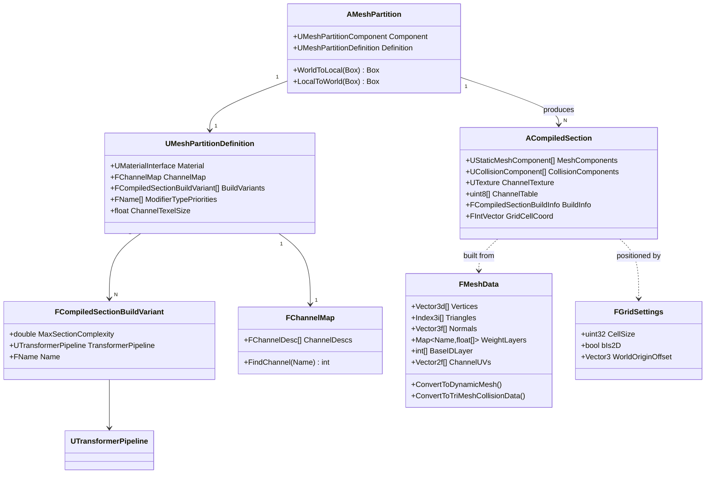
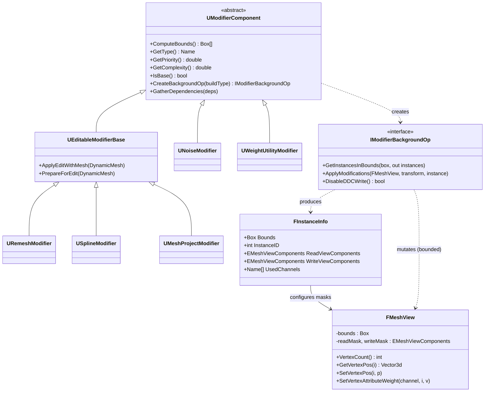
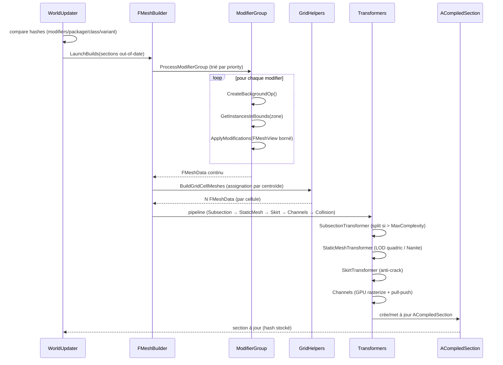
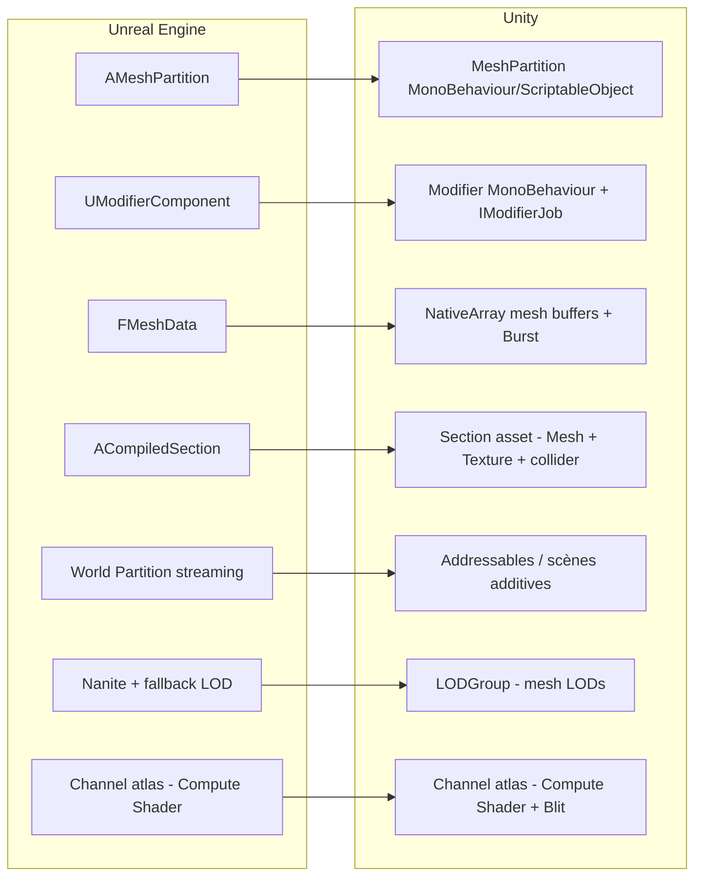

# 03 — Diagrammes

Diagrammes en **Mermaid** (rendus par la plupart des viewers Markdown / GitHub / IDE) avec un repli ASCII pour
les schémas de flux. Pour un agent IA, le Mermaid est directement parsable.

---

## 3.1 Diagramme de classes — Données & runtime



---

## 3.2 Diagramme de classes — Modifier stack (non-destructif)



---

## 3.3 Diagramme de séquence — Build d'une zone



---

## 3.4 Flux de données du pipeline (ASCII)

```
  [Heightmap.png]   [Mesh stamp]   [Spline]            ← ENTRÉES (base modifiers)
        \               |            /
         \              |           /
          v             v          v
       ┌────────────────────────────────┐
       │   BASE FMeshData (continu)      │
       └───────────────┬────────────────┘
                       │  MODIFIER STACK (priority layers)
        ┌──────────────┼──────────────┐
        v              v              v
   [Noise]        [Spline road]   [Weight paint]      ← chaque modifier borné (FMeshView)
        └──────────────┼──────────────┘
                       v
       ┌────────────────────────────────┐
       │   FMeshData modifié (continu)   │
       └───────────────┬────────────────┘
                       │  PARTITION (centroïde → cellule)
        ┌──────────┬───┴────┬──────────┐
        v          v        v          v
     cell(0,0)  cell(1,0) cell(0,1)  cell(1,1)         ← N FMeshData
        │          │        │          │
        │  (chaque cellule, en parallèle :)
        v          v        v          v
   ┌─────────────────────────────────────────┐
   │ C1 Channels → atlas texture (GPU)        │
   │ C2 LOD quadric + Skirt → UStaticMesh     │
   │ C3 Tri-mesh collision + physical mat     │
   └────────────────────┬────────────────────┘
                        v
            ACompiledSection × N  (streamés)
```

---

## 3.5 Mapping conceptuel UE → Unity (vue d'ensemble)


